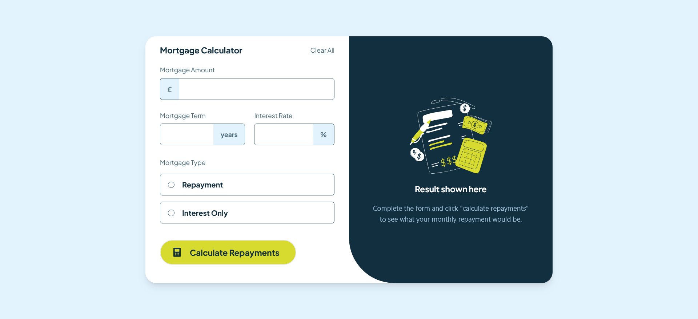
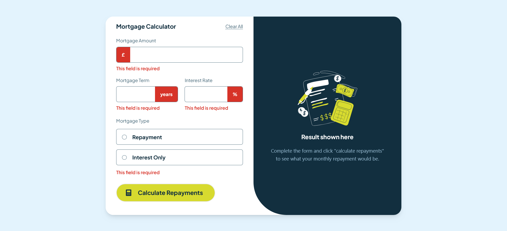
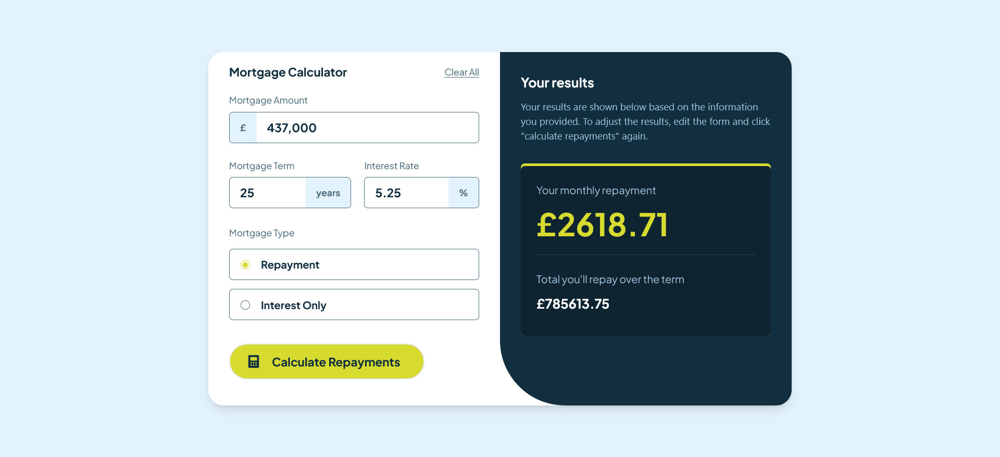

# Frontend Mentor - Mortgage repayment calculator solution

This is a solution to the [Mortgage repayment calculator challenge on Frontend Mentor](https://www.frontendmentor.io/challenges/mortgage-repayment-calculator-Galx1LXK73). Frontend Mentor challenges help you improve your coding skills by building realistic projects. 

Also, I didn't get any figma or any other design file to accurately match the original design, and for my one, I tried my best to calculate the sizes of the elements by analyzing them with my naked eye.

## Table of contents

- [Frontend Mentor - Mortgage repayment calculator solution](#frontend-mentor---mortgage-repayment-calculator-solution)
  - [Table of contents](#table-of-contents)
  - [Overview](#overview)
    - [Mortgage repayment calculator Screenshot](#mortgage-repayment-calculator-screenshot)
    - [Links](#links)
  - [My process](#my-process)
    - [Built with](#built-with)
    - [What I learned](#what-i-learned)

**Note: Delete this note and update the table of contents based on what sections you keep.**

## Overview

### Mortgage repayment calculator Screenshot

### Links

- Live Site URL: [https://mortgage-calculator-h89.vercel.app/](https://mortgage-calculator-h89.vercel.app/)

## My process

### Built with

- React + TailwindCSS

### What I learned

It took me 2 days to complete this project. I learned so much from this use state, use context, and many tailwind CSS and react best practices. More practice is needed to go. It boosted my confidence. I just have to practice more and more.
